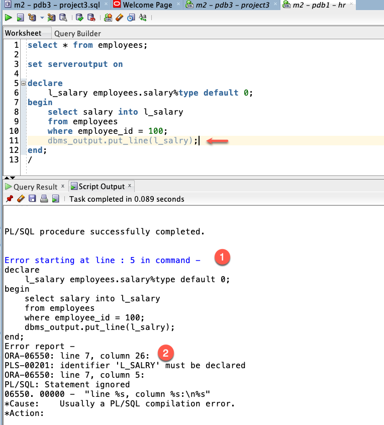

# 尋找錯誤行 (P02_02)

## 說明

當 PL/SQL block 編譯錯誤時，Oracle 會產生一個錯誤報告，報告中包含了錯誤的資訊，例如錯誤的行號、錯誤的訊息等。我們可以從錯誤報告中找到引發錯誤的程式碼行。

我們會先找排除錯誤報告中的第一行，然後再試著編譯 block，看是否能成功。

錯誤報告的行號是相對於 block 的行號，而不是相對於整個檔案的行號。
要找到錯誤發生的檔案行號，我們需要知道 block 在檔案中的起始行號。

底下的公式可以幫助我們找到錯誤發生的檔案行號：

```
錯誤檔案行號 = block 起始行號 + 錯誤報告行號 - 1
```

例如, 如果錯誤報告中的行號是 `5`, 代表錯誤發生在 block 的第五行。
此時，如果你的 block 是從檔案的第 10 行開始，那麼錯誤發生在檔案的第 (10 + 5 - 1) = 14 行。

## 範例

這個例子的 Error Report 告訴我們的第一件事是發生錯誤的區塊是從第 5 行開始的：

> Error starting at line: 5 in command -

接著在 `Error report -` 的下一行, 我們看到了錯誤的代碼:
> ORA-06550: line 7, column 26:

這告訴我們錯誤發生在 block 的第 7 行，第 26 個字元。

所以, 發生錯誤的檔案行號是第 (5 + 7 - 1) = 11 行




在錯誤代碼的下一行，我們可以看到錯誤的訊息：
> PLS-00201: identifier 'L_SALRY' must be declared

這告訴我們錯誤的原因是變數 `L_SALRY` 沒有被宣告。

查看在檔案的第 11 行，我們可以看 DBMS_OUTPUT.PUT_LINE 陳述句中的變數 `L_SALRY` 拼寫錯誤。所以, 引起變數未宣告的錯誤。

修正拼寫錯誤後，再次編譯 block，應該可以成功。

## 結語

- 寫程式必定會遇到錯誤, 錯誤報告是一個很好的起點來找到錯誤的原因。
- 學習看錯誤報告, 並從中找到錯誤的原因, 是成為一個優秀的程式設計師的重要技能之一。
- 發生錯誤的區塊行號必需轉換成檔案行號, 才能找到檔案中的錯誤行。
- 錯誤報告中會提供: 1)產生錯誤的區塊的起始行號, 2)在該區塊中的錯誤行號, 3)錯誤的訊息。
- 區塊錯誤行號轉成檔案行號的公式: `錯誤檔案行號 = block 起始行號 + 錯誤報告行號 - 1`。


