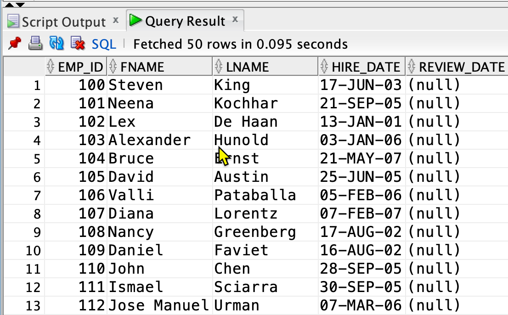
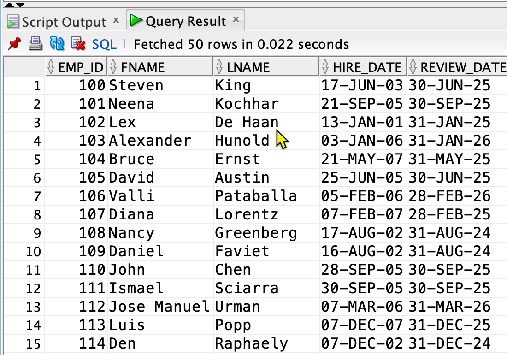

# 使用顯式游標(Explicit Cursor) 對資料表執行 更新或刪除 的操作 (P08_01)

## 描述

一般來說，我們會使用 Update 或 Delete 敘述執行對資料表的操作。 Oracle 會在內部執行迴圈，對每一列進行更新或刪除，是非常有效率的敘述。

但是，有時候我們需要對資料表進行較複雜的操作，這些操作無法用單一 SQL 敘述表達。這時，我們可以使用顯式游標(Explicit Cursor)，在 PL 中逐列進行操作。
注意，這種方式相對於使用 Update 或 Delete 敘述，效率較低。

在使用顯式游標修改資料列時，我們需要在 `SELECT` 敘述中使用 `FOR UPDATE` 子句來鎖定所取得的資料列，以防止其他會話對其進行修改。

在使用游標 for-loop 進行逐列更新時，我們使用 `WHERE CURRENT OF <cursor>` 子句來限定要異動的資料列為目前游標所指向的資料列。這樣可以使更新敘述更為簡潔。

簡而言之，
1. 為什麼需要使用顯式游標進行 DML 操作？條件過於複雜，無法用單一 SQL 敘述表達。
2. 何時使用 `FOR UPDATE` 子句？需要使用顯式游標進行更新或刪除資料列時。
3. 何時使用 `WHERE CURRENT OF <cursor>` 子句？需要參考游標中的目前資料列進行更新或刪除時。

## 範例: 使用顯式游標更新資料列 

公司的員工需要在每兩年的月底進行一次評鑑。我們需要定期更新 `emp_review_list` 表格中的 `review_date` 欄位，以便每位員工都能在正確的日期進行評鑑。

使用以下的 DDL 敘述建立 `emp_review_list` 表格:

```sql
create table emp_review_list(emp_id, fname, lname, hire_date, review_date) as 
select employee_id, first_name, last_name, hire_date, cast(null as date)
from employees;
```



表格內的 `hire_date` 欄位是員工的入職日期，`review_date` 欄位是員工的下次評鑑日期。每位員工需要在入職兩年後的月底進行一次評鑑。

### 員工評鑑日期的計算

每位員工需要在入職兩年後的月底進行一次評鑑。
例如, 如果一位員工的入職日期是 2005-01-15，第一次評鑑日期是 2007-01-31，第二次評鑑日期是 2009-01-31，以此類推。

計算評鑑日期的步驟如下:

#### Step 1. 計算員工的下一個評鑑週期

2 年(24個月)為一個評鑑週期. 先算出自入職日期到現在的月數，再除以24取整數，再加1，即為下一個評鑑週期。

轉換成 PL/SQL 敘述如下:

```sql
review_cycle = trunc((months_between(sysdate, hire_date) / 24)) + 1
```

`trunc((months_between(sysdate, hire_date) / 24))` 是自入職日期到現在的週期數，加1即為下一個週期。

#### Step 2. 計算員工的評鑑日期

將評鑑週期(`review_cycle`)乘以24個月，再加上入職日期，即為員工的下一次評鑑日期，之後再取得評鑑日期所在月份的最後一天。

轉換成 PL/SQL 敘述如下:
``` sql
review_date = last_day(add_months(hire_date, review_cycle * 24))
```
其中:
- `add_months(hire_date, review_cycle * 24)` 是下一次評鑑日期(24 為月份數，一個評鑑週期)。
-  `last_day` 回傳該月份的最後一天。

### 使用顯式游標更新資料列

使用上述步驟，我們可以撰寫 PL/SQL 區塊來更新 `emp_review_list` 表格中每位員工的下次評鑑日期。

我們使用逐列更新的方式，對每位員工進行更新，因為計算下次評鑑日期的邏輯較為複雜。

在區塊中，我們將:
1. 宣告一個顯式游標取得符合條件的資料列及欄位，並使用 `FOR UPDATE` 子句鎖定資料列。
2. 使用游標 for-loop 逐列進行操作。
3. 在游標 for-loop 內使用 UPDATE 敘述更新，並使用 `WHERE CURRENT OF` 子句參考游標目前指向的資料列。

上述步驟轉換成 PL/SQL 區塊如下:

```sql
set serveroutput on
declare
    -- #1 宣告顯式游標
    cursor c_emp_review_list is
        select *
        from emp_review_list
        -- #1 使用 FOR UPDATE 子句鎖定資料列
        for update; 

    l_review_cycle number;
    l_review_date date;
begin
    -- #2 使用游標 for-loop 逐列進行操作
    for emp in c_emp_review_list loop -- 取得的資料列會放在 emp 自動變數中，emp 是一個 record 變數
        -- 計算下次評鑑週期
        l_review_cycle := trunc((months_between(sysdate, emp.hire_date) / 24)) + 1;
        -- 計算下次評鑑日期
        l_review_date := last_day(add_months(emp.hire_date, l_review_cycle * 24));
        -- 修改 emp (record 變數) 中的 review_date 欄位
        emp.review_date := l_review_date;
        -- #3 更新資料列
        update emp_review_list
            set ROW = emp  -- 更新整個資料列
            -- #3 使用 WHERE CURRENT OF 子句參考游標目前指向的資料列
            where current of c_emp_review_list;
    end loop;
end;
/
```

執行結果:



### 優化你的 PL/SQL 區塊

上述區塊可以進行一些修改，使其更有效率:

1. 如果只是要更新 `review_date` 欄位，而不是整個資料列，可以使用 `FOR UPDATE OF <column>` 子句只鎖定 `review_date` 欄位。

2. 在游標 for-loop 中，我們使用 record 變數 `emp` 來更新一列。如果只更新 `review_date` 欄位，可以將更新敘述修改如下:

```sql
...
    emp.review_date := review_date;
update emp_review_list
    set review_date = review_date
    where current of c_emp_review_list; 
...
```

這個只更新 `review_date` 欄位的版本如下:


```sql
set serveroutput on
declare
    cursor c_emp_review_list is
        select *
        from emp_review_list
        for update of review_date;
    l_review_cycle number;
    l_review_date date;
begin
    for emp in c_emp_review_list loop
        l_review_cycle := trunc((months_between(sysdate, emp.hire_date) / 24)) + 1;
        l_review_date := last_day(add_months(emp.hire_date, l_review_cycle * 24));
        --  只更新 review_date 欄位
        update emp_review_list
            set review_date = l_review_date
            where current of c_emp_review_list;
    end loop;
end;
/
```
